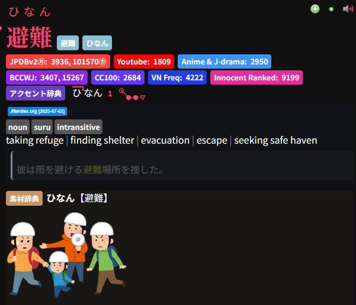
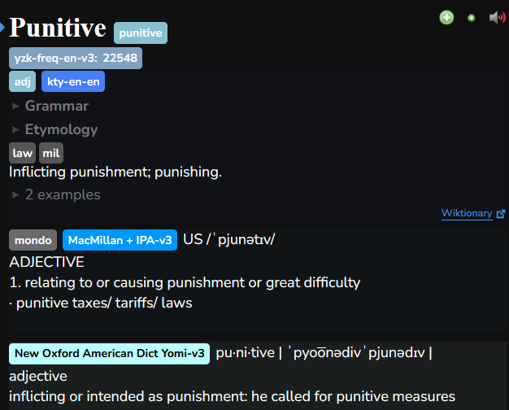

# My Yomitan Settings
This is my backup repository for my Yomitan settings.
Those custom CSS are modified versions of BrenoAqua's amazing [custom CSS](https://brenoaqua.github.io/Senren/yomitan/#result-display-setting).

## Dictionaries
You can find all of them in [Marv's Yomitan Dictionaries Github page](https://github.com/MarvNC/yomitan-dictionaries)

### 🇯🇵 Japanese
#### Frequency List
- JPDBv2㋕ (*Rank-based*) - ***Main***
- アクセント辞典 (*Pitch*)
- Youtube
- Anime & J-drama
- BCCMW
- CC100
- VN Freq
- Innocent Ranked
#### Grammar
- Jitendex - ***Main***
- KANJIDIC
- 素材辞典 (*Kaishi with images*)
- 日本語文法辞典(全集) (*DOJG Dictionary*)
- Pixiv Light

---------------------------------------------------------------------------------
### 🇺🇸 English
#### Frequency List
- yzk-freq-en-v3
#### Grammar
- kty-en-en - ***Main***
- MacMillan + IPA-v3
- New Oxford American Dict Yomi-v3

## Anki Card Types
- [**Lapis**](https://github.com/donkuri/lapis)
  - For internet + Youtube mining.
  - *Created by the legend Donkuri.*
- [**Senren**](https://brenoaqua.github.io/Senren/)
  - Amazing card type for Anime immersion mining.
  - *Created by BrenoAqua.*
- **Venren**
  - My Senren customization for English mining.