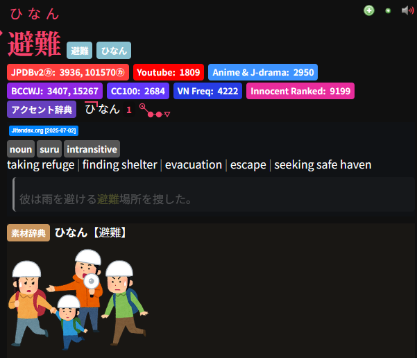
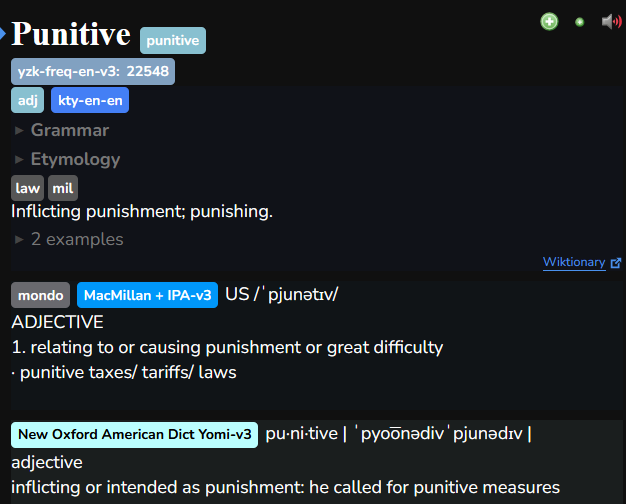

# My Yomitan Settings
This is my backup repository for my Yomitan settings.
Those custom CSS are modified versions of BrenoAqua's amazing [custom CSS](https://brenoaqua.github.io/Senren/yomitan/#result-display-setting).

## Dictionaries
You can find all of them in [Marv's Yomitan Dictionaries Github page](https://github.com/MarvNC/yomitan-dictionaries)

### 🇯🇵 Japanese

#### Frequency Lists

- **JPDBv2㋕** — Rank-based | `JPDB v2.2 Frequency Kana 2024-10-13` ⭐ **Main**
- **Jiten** — `Jiten 26-09-02`
- **Youtube** — `frequency3`
- **Anime & J-drama**
- **BCCWJ** — `1`
- **CC100** — `1`
- **JLPT** — `2025.08.01.0`
- **TMW v2** — `3.0`

#### Pitch Accent

- **NHK** — `pitch_1.0.1.1`
- **大辞泉** — `pitch_1.0.0.1`
- **新明解第八版** — `pitch_1.0.2.1`
- **大辞林第四版** — `pitch_1.0.1.1`

#### Dictionaries

- **Jitendex.org** — `2026.08.11.0` ⭐ **Main**
- **JMnedict** — `JMnedict.2026-09-04`
- **KANJIDIC** — `kanjidic2.2026-247`
- **Pixiv Light** — `2026-09-04`
- **三省堂国語辞典 第八版** — `三省堂国語辞典 第八版`
- **小学館例解学習国語 第十二版** — `rgko12;2025-08-18`
- **明鏡国語辞典 第三版** — `meikyo3;2025-08-18`
- **新明解国語辞典 第八版** — `smk8;2024-10-14`
- **新選国語辞典 第十版** — `sskok10;2024-10-12`
- **大辞林 第四版** — `daijirin2;2023-07-10`
- **四字熟語辞典オンライン** — `jitenon-yoji;2023-05-14`

#### Grammar

- **日本語文法辞典(全集)** — DOJG Dictionary | `DOJG_v1.01;2022-04-30;better formatting`
- **JLPT文法解説まとめ** — `nihongo_kyoshi_v1.03;2022-05-27;p.o.s. info`

---------------------------------------------------------------------------------
### 🇺🇸 English
#### Frequency List
- yzk-freq-en-v3
#### Grammar
- kty-en-en - ***Main***
- MacMillan + IPA-v3
- New Oxford American Dict Yomi-v3

## Anki Card Types
- [**Lapis**](https://github.com/donkuri/lapis)
  - For internet + Youtube mining.
  - *Created by the legend Donkuri.*
- [**Senren**](https://brenoaqua.github.io/Senren/)
  - Amazing card type for Anime immersion mining.
  - *Created by BrenoAqua.*
- **Venren**
  - My Senren customization for English mining.